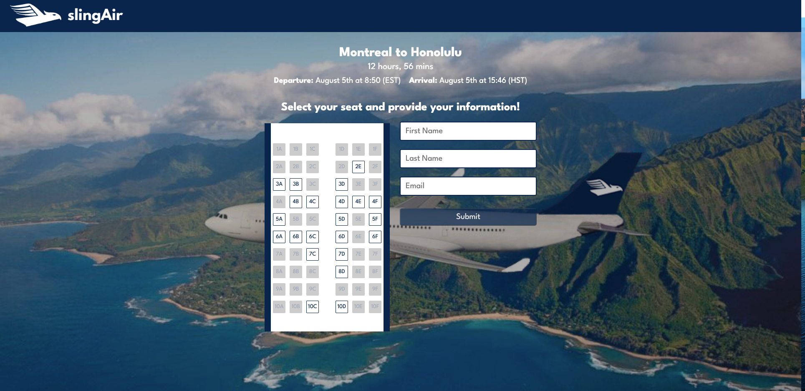

# SlingAir Ticket Booker

This was my first project using the MongoDB database. The ticket booker allows users to book one of 8 flights from Canadian cities to Honolulu. For each booking, the availability of the seats gets updated and recorded in the database.

A demo of this project can be found at the following link: https://www.youtube.com/watch?v=iyu7ZcsxeZs&ab_channel=MatthewLangmuir

## Development

### Frontend
Access directory by entering`cd frontend`. Then, download yarn by simply typing `yarn`, and start the local host with `yarn dev:frontend`.

### Backend
Enter the following in the terminal to run proxy on port 8000: `cd backend`, `yarn dev:backend`

